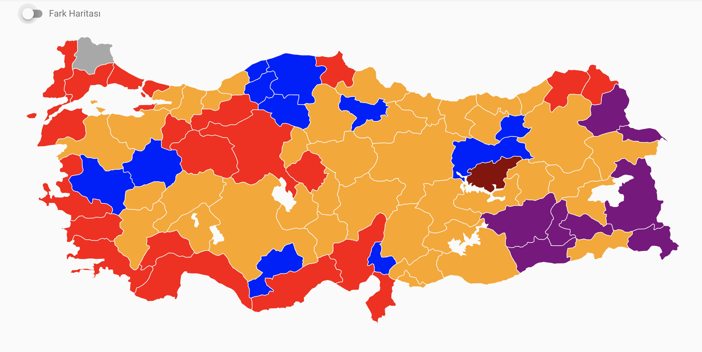
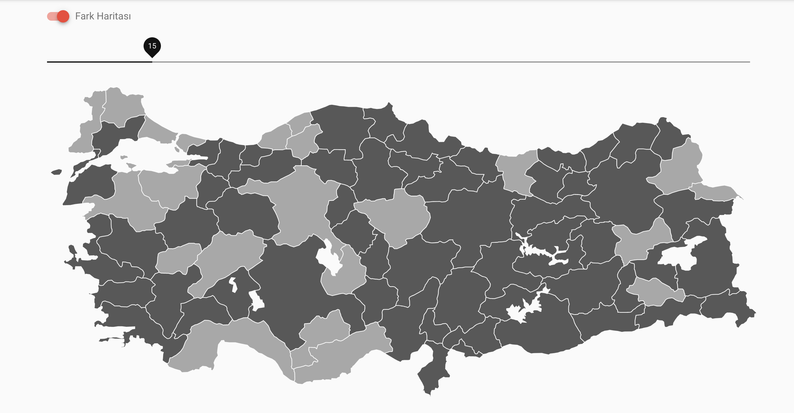

# ajans15

> Atölye15 Staj Kampı Seçim 2019 Projesi

> SVG Türkiye Haritası: https://github.com/dnomak/svg-turkiye-haritasi

## Ekran Görüntüleri



> Birinci ve ikinci parti arasındaki yüzdelik oy farkı belirtilen orandan fazla ise koyu renk, az ise açık renk olarak gösteren fark haritası:


## Kurulum

``` bash
$ npm install
$ npm run dev
```

